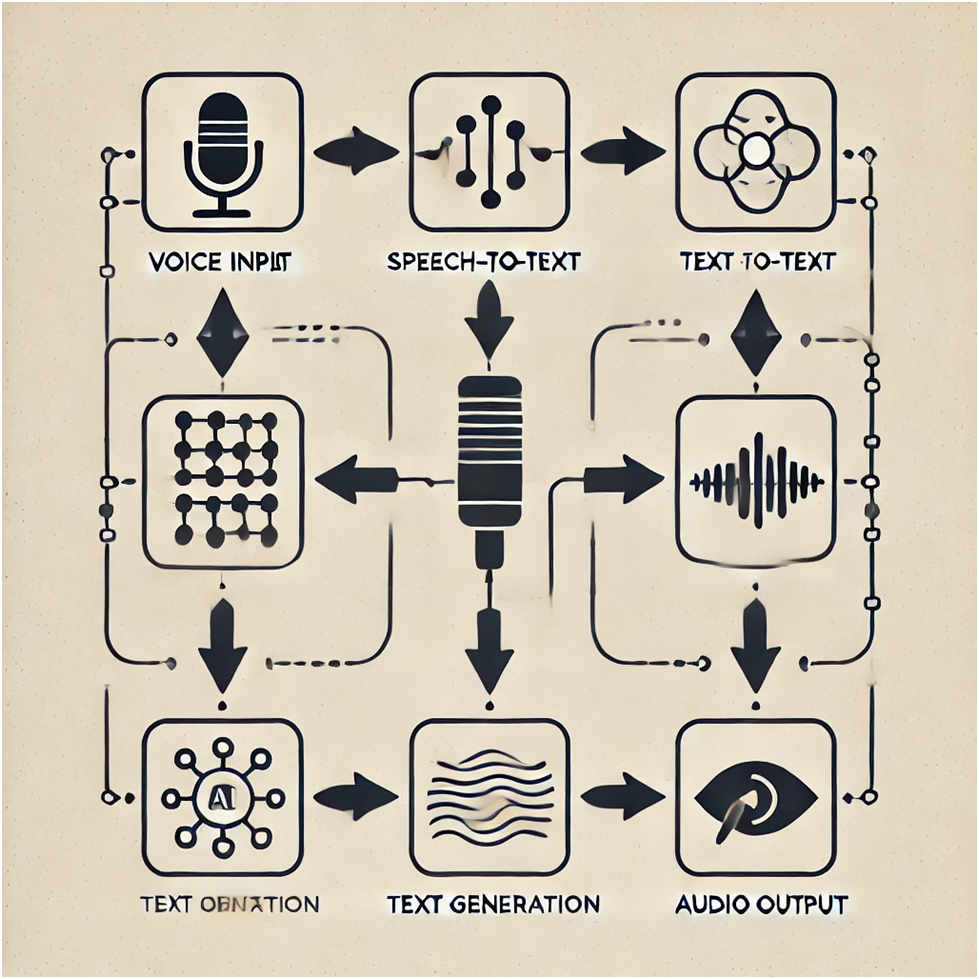

Documentation for AI voice assistance pipeline

Detailed Description of Solution

Overview:
The end-to-end AI voice assistance pipeline involves converting a voice command into text, processing that text through a Large Language Model (LLM), and converting the response back into speech. The system is designed to have low latency, detect voice activity, restrict the output to two sentences, and allow for tunable parameters such as pitch, voice type (male/female), and speed.

Step-by-Step Implementation:

Step 1: Voice-to-Text Conversion

•	Model Choice: We use the Whisper model from OpenAI for converting speech to text. Whisper is known for its high accuracy and support for multiple languages.

Settings:

•	Sampling Rate: 16 kHz
•	Audio Channel Count: 1 (Mono)
•	VAD Threshold: 0.5 (to detect voice activity and ignore silence)

Step 2: Text Input into LLM

•	Model Choice: We use the transformers library from Hugging Face to access a pre-trained LLM like Mistral or similar for text generation.

Settings:

•	Model: Mistral
•	Response Length: Restricted to 50 tokens (approximately 2 sentences)

Step 3: Text-to-Speech Conversion

•	Model Choice: We use edge-tts, an open-source Text-to-Speech model that supports adjustable parameters such as pitch, voice type, and speed.

Settings:

•	Voice: en-US-JennyNeural
•	Pitch: +10%
•	Speed: +5%

Additional Requirements

•	Latency: The system is designed to achieve low latency by leveraging efficient models and pipelines.

•	Voice Activity Detection (VAD): Implemented with a threshold to ensure only voice is processed.

•	Output Restriction: Response text is truncated to a maximum of two sentences.
•	Tunable Parameters: Allow for adjustments in pitch, voice type, and speed in the text-to-speech conversion.

Architecture Overview:

The pipeline consists of three main steps:

1.	Voice Input (Audio Signal)
2.	Speech-to-Text Conversion (Using Whisper)
3.	Text Generation (Using a Large Language Model)
4.	Text-to-Speech Conversion (Using edge-tts)
5.	Audio Output
Architecture Diagram Description:
1.	Voice Input:
o	Source: The system starts with a voice input, either from a microphone or an audio file.
o	Data: This voice input is processed as an audio signal.
2.	Speech-to-Text Conversion (Whisper):
o	Component: The Whisper model takes the audio signal as input.
o	Process: It transcribes the speech into text, using settings like a 16 kHz sampling rate, mono channel, and VAD threshold of 0.5.
3.	Text Generation (LLM):
o	Component: The transcribed text is then passed into a Large Language Model (LLM), such as Mistral, for processing.
o	Process: The LLM generates a text response, restricted to 50 tokens (approximately two sentences).
4.	Text-to-Speech Conversion (edge-tts):
o	Component: The generated text is passed to the edge-tts model.
o	Process: The text is converted back into speech, with tunable parameters like pitch, voice type, and speed.
5.	Audio Output:
o	Result: The final output is an audio file, such as response_audio.mp3, containing the synthesized speech.

Architecture Diagram:

